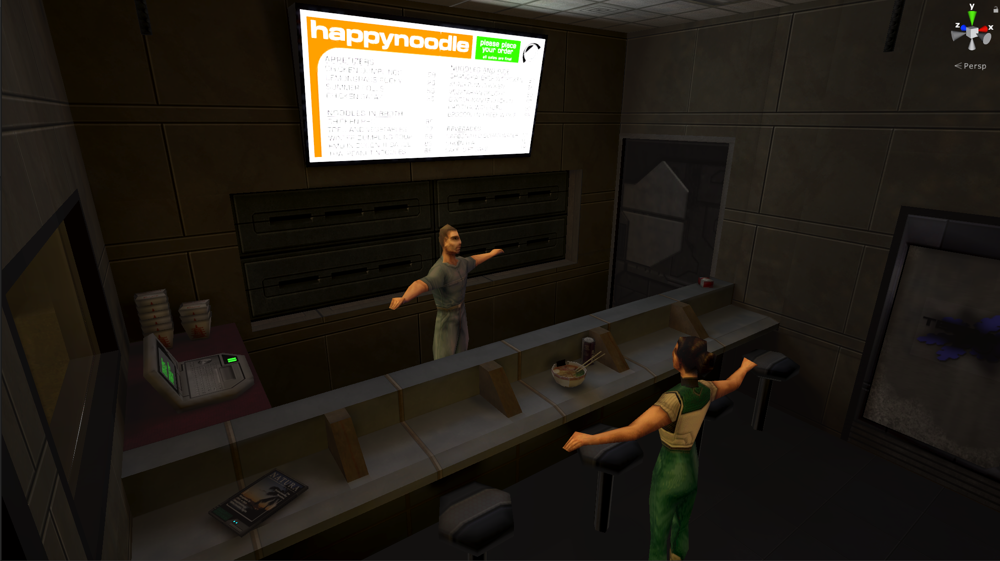
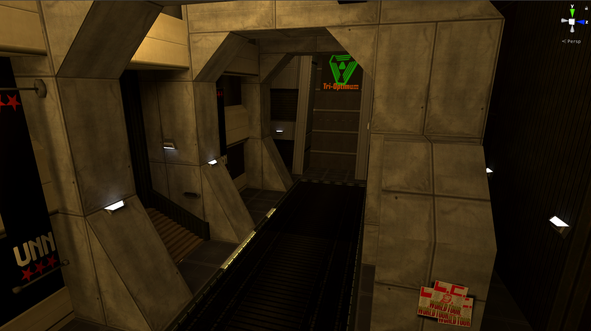
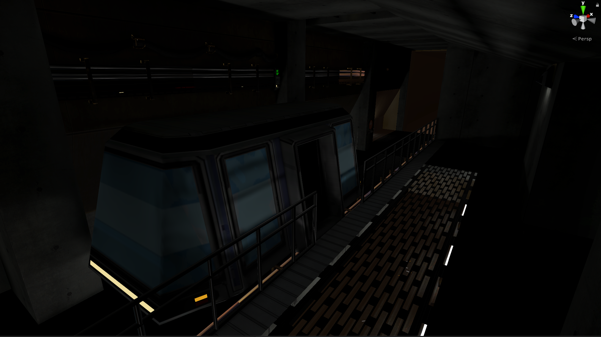
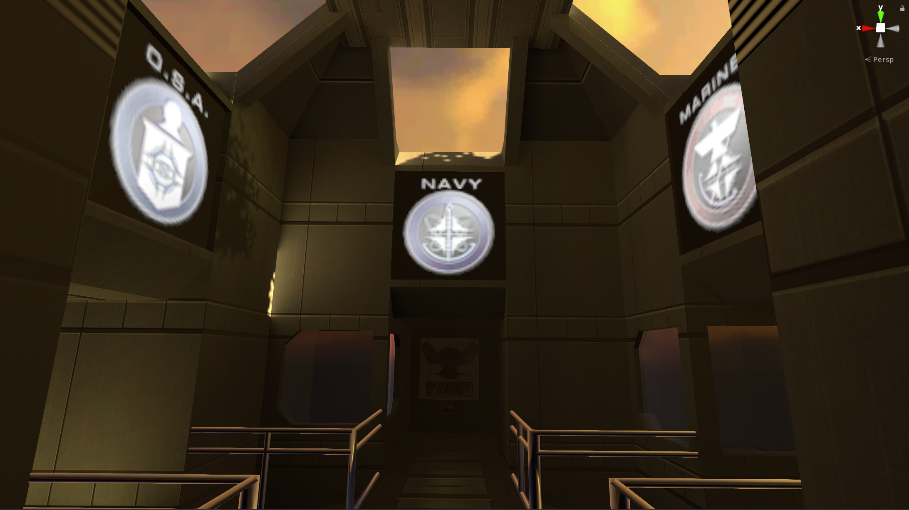
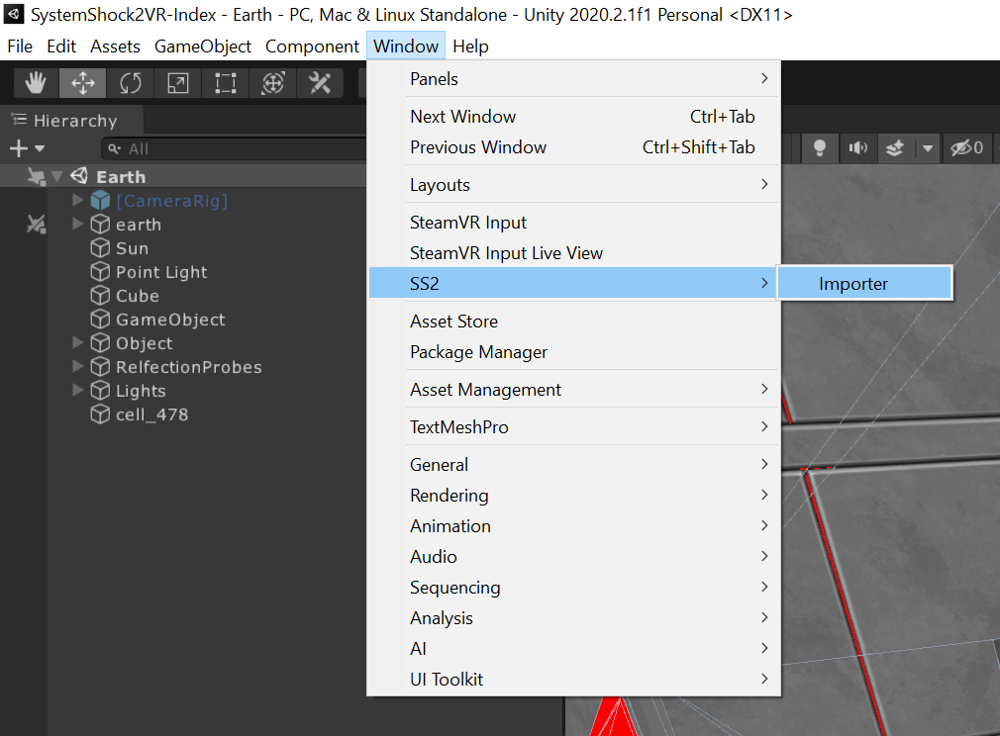
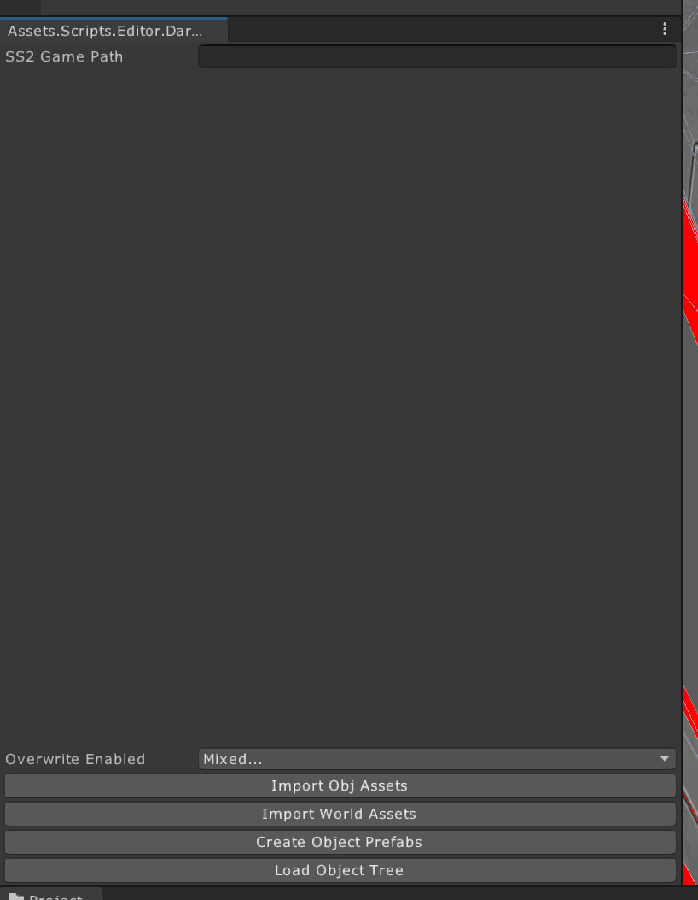
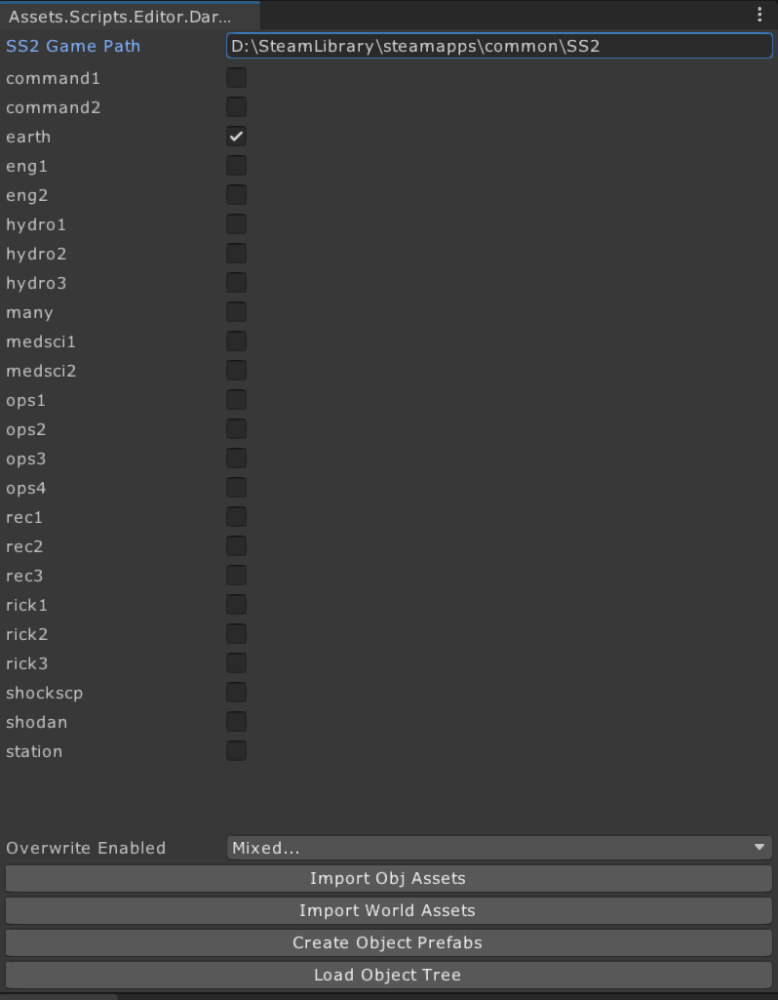

This is an unfinished project. Its main functionality is to import SystemShock2 levels. 
### Features:
 - import Level geometry from .mis files
 - import Object geometry from .bin files
 - import Textures from .pcx, .gif, .png, .dds, .bmp, .tga files
 - import Object and Level materials from .mdl files or directly from textures
 - import animations from a motion.bin (Animations are buggy. Probably do to an misapplied matrix somewhere. Animations are not usable.) 
 - handle mod loading order
 - has  a system to read Darkobjects and their properties
 - read room definitions
 - automatically create functioning doors in unity
 - parse mtl files (incomplete, only certain values are read)

Currently it can import levels and populate them with the objects found within.  

## How to use
This project was created in Unity 2020.2.1f. You need to install Unity3d and open the project with it.

The repository does not track assets from SS2. (EVERYTHING IN THE Assets/SS2 IS IGNORED BY GIT!) Every asset needs to be imported by yourself from a local installation of SS2. Sadly mods paths are hard coded right now and are required to be present. The importer will look for assets in the following paths and order:
- DMM/Vurt's SS2 Flora Overhaul 1.0k
- DMM/AccFam_20
- DMM/SS2_Rebirth_v05b
- DMM/SS2_Vaxquis_VintageSongRemake
- DMM/SHTUP-ND_beta1
- DMM/obj_fixes_v12,
- DMM/SCP_beta4
- patch_ext
- patch/res
- Data/res

These paths are relative to your SS2 installation directory. Please make sure these paths exist, by either installing the corresponding mod, or creating an empty folder in place.

Before searching in any of the mentioned paths, **SystemShock2VR/SS2DataRoot** (folder existing in project) is searched. Use it like a mod to overwrite certain files.

**Important**: Unzipping of .crf files is not done automatically. A .crf file is just a normal .zip file. The importer does not search for assets within them. You have to unpack them yourself before hand. Just copy a .crf, rename it to .zip and extracted in its current folder.

When you have done everything correctly, your SS2 installation should have the following paths:
- DMM
	- Vurt's SS2 Flora Overhaul 1.0k
	- AccFam_20
	- SS2_Rebirth_v05b
	- SS2_Vaxquis_VintageSongRemake
	- SHTUP-ND_beta1
	- obj_fixes_v12,
	- SCP_beta4
- patch_ext
- patch
	- res
- Data 
	- res
		- obj
		- mesh
		- fam
		- motions
		- bitmap
		- ...

After you have opened the project, there will be a importer window accessible under Window/SS2/Importer in the top bar.

The importer window looks like this.

Fill in the path to your SS2 installation and the importer will show you all levels it found. (NOTE: to refresh the importer window after filling in the path, the path field has to loose keyboad focus!)

Now you can select the levels you would like to importer. Click on **Import World Assets** to import the level geometry, textures and materials. You will find a new prefab named after the imported level. Drag it into the scene to view the level geometry.

Click on **Import Object Assets** to import all objects found in the selected levels. This will import their geometry, animations, textures and materials. It will also create a prefab for each one.

Click on **Create Object Prefabs** to create prefabs for each object defined in the Darkengines object hierachy.

Finally click on **Load Object Tree** to load all objects from the first selected level into the current scene. This sets up their position and some other stuff.

Congrats, you just imported your first level!

NOTE: This has been tested with every SS2 level and works alright. 
If you are getting blank materials, please import the materials again to try and fix it. When textures and materials are imported in one go, materials may loose the reference to the assigned texture. Reimporting with textures present and override flags set to "material" can help.

**Override enabled** is a flag field. If a flag is set, the importer will overwrite already imported assets of that type. If it is not set, those assets will not be overwriten.

## What does not work?
**Animations**: imported animations lead to the characters flipping out. I think something goes wrong when transforming the animations from DarkEngine space to Unity space. Rigged characters do work. Bones work and everything.

**Certain materials**: Every effect in MTL is a separete render pass which draws the complete object again. This is a nightmare solution, I won't support. Currently I'm matching certain patterns in MTL files with certain Shaders in unity. But only a few things get currently mapped. For everything else the first texture found in an MTL is used. This may lead to wierd looking textures or transparent textures. 
If one wanted to make a reflective material in MTL, one would first draw the texture at half alpha and then draw the reflection map at half alpha on top of it. This. Is. Madness.

**Import of light sources**: The new WREXT chunk has a different layout for lights defined. Importing them does not work. You will have to place light source by your self. 

## Besides the importer, what else is in this project?
For one, there is the SteamVR-Plugin used to view the levels in VR. It is not required and can be safely deleted. Besides that, not much. If you have seen certain features in my devlogs, most of them aren't in this. This project started out as a complete refractoure of the old project and not all things where ported over yet.
But there is code to emulate DarkEngines message passing system. Its what makes the doors open.

## Why did work on this project stop?

Nightdive announced their own VR version of SS2. Thus this project became obsolete.
